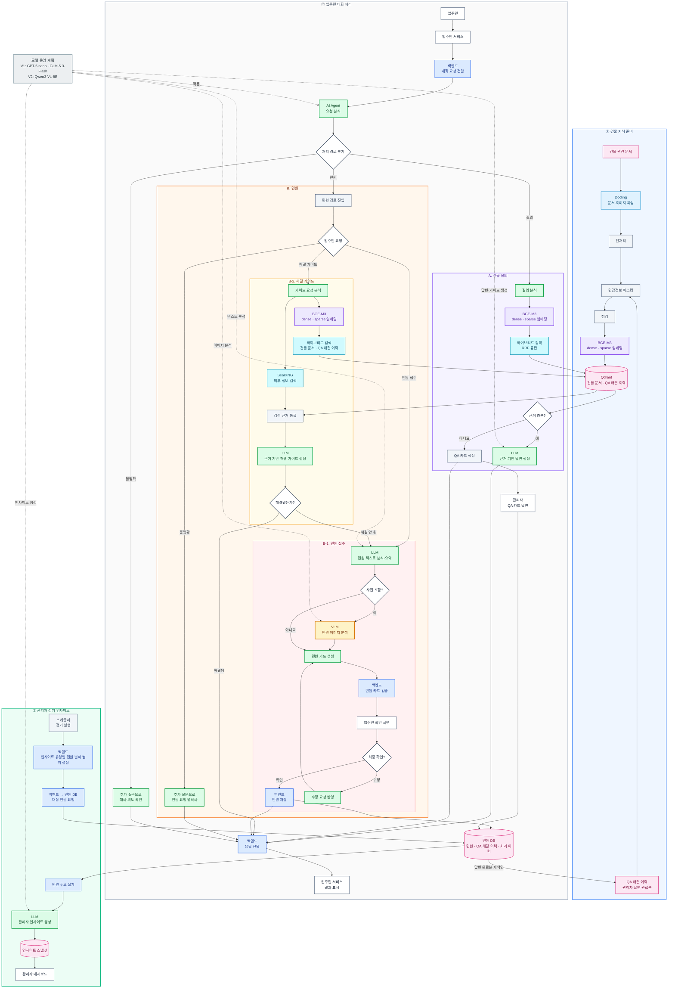

```mermaid
flowchart TB
    %% ① 건물 지식 준비
    subgraph PREP["① 건물 지식 준비"]
        DOCS["건물 관련 문서"]
        QA_HIST["QA 해결 이력<br/>관리자 답변 완료분"]
        PARSE["Docling<br/>문서·이미지 파싱"]
        PREPROCESS["전처리"]
        MASK["민감정보 마스킹"]
        CHUNK["청킹"]
        EMBED["BGE-M3<br/>dense · sparse 임베딩"]
        VDB[("Qdrant<br/>건물 문서 · QA 해결 이력")]

        DOCS --> PARSE
        PARSE --> PREPROCESS
        PREPROCESS --> MASK
        QA_HIST --> MASK
        MASK --> CHUNK
        CHUNK --> EMBED
        EMBED --> VDB
    end

    %% ② 입주민 대화 처리
    subgraph CONVERSATION["② 입주민 대화 처리"]
        RESIDENT["입주민"]
        FRONT["입주민 서비스"]
        BE_REQUEST["백엔드<br/>대화 요청 전달"]
        AGENT["AI Agent<br/>요청 분석"]
        ROUTE{"처리 경로 분기"}

        RESIDENT --> FRONT
        FRONT --> BE_REQUEST
        BE_REQUEST --> AGENT
        AGENT --> ROUTE

        %% A. 건물 질의
        subgraph QUESTION["A. 건물 질의"]
            Q_START["질의 분석"]
            Q_EMB["BGE-M3<br/>dense · sparse 임베딩"]
            Q_SEARCH["하이브리드 검색<br/>RRF 융합"]
            Q_ENOUGH{"근거 충분?"}
            Q_ANSWER["LLM<br/>근거 기반 답변 생성"]
            Q_CARD["QA 카드 생성"]

            Q_START --> Q_EMB
            Q_EMB --> Q_SEARCH
            Q_ENOUGH -->|"예"| Q_ANSWER
            Q_ENOUGH -->|"아니요"| Q_CARD
        end

        %% B. 민원
        subgraph COMPLAINT["B. 민원"]
            C_START["민원 경로 진입"]
            ACTION{"입주민 요청"}

            C_START --> ACTION

            %% B-1. 민원 접수
            subgraph REGISTER["B-1. 민원 접수"]
                TEXT_ANALYSIS["LLM<br/>민원 텍스트 분석·요약"]
                HAS_IMAGE{"사진 포함?"}
                IMAGE_ANALYSIS["VLM<br/>민원 이미지 분석"]
                CARD["민원 카드 생성"]
                DRAFT_CHECK["백엔드<br/>민원 카드 검증"]
                REVIEW["입주민 확인 화면"]
                CONFIRM{"최종 확인?"}
                SAVE["백엔드<br/>민원 저장"]
                REVISE["수정 요청 반영"]

                TEXT_ANALYSIS --> HAS_IMAGE
                HAS_IMAGE -->|"예"| IMAGE_ANALYSIS
                IMAGE_ANALYSIS --> CARD
                HAS_IMAGE -->|"아니요"| CARD
                CARD --> DRAFT_CHECK
                DRAFT_CHECK --> REVIEW
                REVIEW --> CONFIRM
                CONFIRM -->|"확인"| SAVE
                CONFIRM -->|"수정"| REVISE
                REVISE --> CARD
            end

            %% B-2. 해결 가이드
            subgraph GUIDE["B-2. 해결 가이드"]
                G_QUERY["가이드 요청 분석"]
                G_EMB["BGE-M3<br/>dense · sparse 임베딩"]
                G_SEARCH["하이브리드 검색<br/>건물 문서 · QA 해결 이력"]
                WEB["SearXNG<br/>외부 정보 검색"]
                G_EVIDENCE["검색 근거 통합"]
                G_ANSWER["LLM<br/>근거 기반 해결 가이드 생성"]
                G_SOLVED{"해결됐는가?"}

                G_QUERY --> G_EMB
                G_EMB --> G_SEARCH
                G_QUERY --> WEB
                WEB --> G_EVIDENCE
                G_EVIDENCE --> G_ANSWER
                G_ANSWER --> G_SOLVED
            end

            C_CLARIFY["추가 질문으로<br/>민원 요청 명확화"]

            ACTION -->|"민원 접수"| TEXT_ANALYSIS
            ACTION -->|"해결 가이드"| G_QUERY
            ACTION -->|"불명확"| C_CLARIFY
            G_SOLVED -->|"해결 안 됨"| TEXT_ANALYSIS
        end

        RDB[("민원 DB<br/>민원 · QA 해결 이력 · 처리 이력")]
        ADMIN_REPLY["관리자<br/>QA 카드 답변"]

        ROUTE -->|"질의"| Q_START
        ROUTE -->|"민원"| C_START
        ROUTE -->|"불명확"| CLARIFY["추가 질문으로<br/>대화 의도 확인"]

        Q_SEARCH --> VDB
        VDB --> Q_ENOUGH
        G_SEARCH --> VDB
        VDB --> G_EVIDENCE
        SAVE --> RDB

        Q_CARD --> ADMIN_REPLY
        ADMIN_REPLY --> RDB

        BE_RESPONSE["백엔드<br/>응답 전달"]
        RESULT_VIEW["입주민 서비스<br/>결과 표시"]

        Q_ANSWER --> BE_RESPONSE
        Q_CARD --> BE_RESPONSE
        G_SOLVED -->|"해결됨"| BE_RESPONSE
        SAVE --> BE_RESPONSE
        C_CLARIFY --> BE_RESPONSE
        CLARIFY --> BE_RESPONSE
        BE_RESPONSE --> RESULT_VIEW
    end

    RDB -->|"답변 완료분 재색인"| QA_HIST

    %% ③ 관리자 정기 인사이트
    subgraph INSIGHT["③ 관리자 정기 인사이트"]
        SCHEDULER["스케줄러<br/>정기 실행"]
        RANGE["백엔드<br/>인사이트 유형별 민원 날짜 범위 설정"]
        DB_REQUEST["백엔드 → 민원 DB<br/>대상 민원 요청"]
        AGGREGATE["민원 후보 집계"]
        ANALYZER["LLM<br/>관리자 인사이트 생성"]
        SNAPSHOT[("인사이트 스냅샷")]
        ADMIN["관리자 대시보드"]

        SCHEDULER --> RANGE
        RANGE --> DB_REQUEST
        DB_REQUEST --> RDB
        RDB --> AGGREGATE
        AGGREGATE --> ANALYZER
        ANALYZER --> SNAPSHOT
        SNAPSHOT --> ADMIN
    end

    MODEL_NOTE["모델 운영 계획<br/>V1: GPT-5 nano · GLM-5.3-Flash<br/>V2: Qwen3-VL-8B"]
    MODEL_NOTE -. 적용 .-> AGENT
    MODEL_NOTE -. 텍스트 분석 .-> TEXT_ANALYSIS
    MODEL_NOTE -. 이미지 분석 .-> IMAGE_ANALYSIS
    MODEL_NOTE -. 답변·가이드 생성 .-> Q_ANSWER
    MODEL_NOTE -. 인사이트 생성 .-> ANALYZER

    %% 구역별 배경색
    style PREP fill:#EFF6FF,stroke:#3B82F6,stroke-width:2px,color:#1E3A5F
    style CONVERSATION fill:#FAFAFA,stroke:#94A3B8,stroke-width:2px,color:#334155
    style QUESTION fill:#F5F3FF,stroke:#8B5CF6,stroke-width:2px,color:#4C1D95
    style COMPLAINT fill:#FFF7ED,stroke:#F97316,stroke-width:2px,color:#7C2D12
    style REGISTER fill:#FFF1F2,stroke:#FB7185,stroke-width:1.5px,color:#881337
    style GUIDE fill:#FFFBEB,stroke:#F59E0B,stroke-width:1.5px,color:#78350F
    style INSIGHT fill:#ECFDF5,stroke:#10B981,stroke-width:2px,color:#064E3B

    %% 노드 유형별 색상
    classDef actor fill:#FFFFFF,stroke:#64748B,stroke-width:1.5px,color:#1E293B
    classDef backend fill:#DBEAFE,stroke:#2563EB,stroke-width:1.5px,color:#1E3A8A
    classDef process fill:#F1F5F9,stroke:#64748B,stroke-width:1.5px,color:#334155
    classDef decision fill:#FFFFFF,stroke:#475569,stroke-width:2px,color:#1E293B
    classDef data fill:#FCE7F3,stroke:#DB2777,stroke-width:1.5px,color:#831843

    %% AI 모델 및 외부 도구 색상
    classDef llm fill:#DCFCE7,stroke:#16A34A,stroke-width:2px,color:#14532D
    classDef vlm fill:#FEF3C7,stroke:#D97706,stroke-width:2px,color:#78350F
    classDef embedding fill:#EDE9FE,stroke:#7C3AED,stroke-width:2px,color:#4C1D95
    classDef search fill:#CFFAFE,stroke:#0891B2,stroke-width:1.5px,color:#164E63
    classDef parser fill:#E0F2FE,stroke:#0284C7,stroke-width:1.5px,color:#0C4A6E
    classDef note fill:#ECEFF1,stroke:#607D8B,stroke-width:1.5px,color:#263238

    %% 사용자·화면
    class RESIDENT,FRONT,REVIEW,RESULT_VIEW,ADMIN,ADMIN_REPLY actor

    %% 백엔드
    class BE_REQUEST,DRAFT_CHECK,SAVE,BE_RESPONSE,RANGE,DB_REQUEST,AGGREGATE backend

    %% LLM 사용
    class AGENT,Q_START,Q_ANSWER,TEXT_ANALYSIS,CARD,REVISE,G_QUERY,G_ANSWER,C_CLARIFY,CLARIFY,ANALYZER llm

    %% VLM 사용
    class IMAGE_ANALYSIS vlm

    %% 임베딩 모델
    class EMBED,Q_EMB,G_EMB embedding

    %% 검색 도구
    class Q_SEARCH,G_SEARCH,WEB search

    %% 문서 파싱
    class PARSE parser

    %% 일반 처리
    class PREPROCESS,MASK,CHUNK,C_START,G_EVIDENCE,SCHEDULER,Q_CARD process

    %% 데이터 저장소
    class DOCS,QA_HIST,VDB,RDB,SNAPSHOT data

    %% 분기
    class ROUTE,ACTION,HAS_IMAGE,CONFIRM,Q_ENOUGH,G_SOLVED decision

    %% 모델 운영 계획
    class MODEL_NOTE note

```

